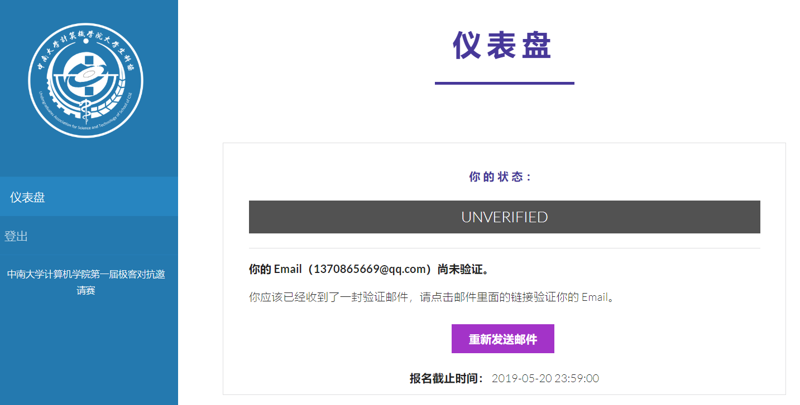

# 注册与报名、Botzone 的基本使用

本章介绍本次竞赛的注册与报名、Botzone 的基本使用。

## 注册与报名

### 在 Botzone 上注册

!!! 注意
    Botzone 不支持 IE 浏览器。

队长（如果是个人参赛则为个人）前往 [Botzone](https://www.botzone.org.cn) 注册。

Botzone 注册完成后就可以开始编写 Bot，但仍需要完成以下步骤以参加本次竞赛。

### 加入比赛小组

队长前往 [Botzone 比赛小组页](https://www.botzone.org.cn/group/5cc64d7275e55951524c4105)，填写加入小组表单，在我们确认参赛信息之后就可以加入小组。

### 在报名系统上报名

**队伍所有队员**访问[报名系统](https://gaming.jxpxxzj.cn:2825)，并在报名系统中完成报名。队长注册时请使用 Botzone 注册时的邮箱，否则我们找不到你的参赛信息。

!!! 注意
    填写 Email 和密码后点击注册按钮即可注册，页面会自动跳转，有短暂无反应是注册请求正在被处理，请耐心等待。

!!! 注意
    如果没有收到邮件，请检查一下是否在垃圾邮箱内。

队长在报名时需要勾选 **“我是队长”** 选项，并在其中填写队伍相关信息。

队长在报名完成后需前往 **队伍** 并创建自己的队伍，队员也需主动加入队伍。

队长和队员完成报名后请及时添加科协官方 QQ：[3231995116](https://user.qzone.qq.com/3231995116) 为好友，并加入竞赛官方 QQ 群：[134425073](https://shang.qq.com/wpa/qunwpa?idkey=d7ae4755243fa1023a74be8592c1e9044e725cc0792a35701691c7c03ddffa7e)。

## Botzone 的基本使用

### 上传 Bot

Bot 就是 AI 程序，在修改样例程序之后，请到右上角 “我的 Bot” 中创建本次比赛游戏的 Bot。

每次对 Bot 代码的修改可以通过点击加号进行。

你还可以选择加入天梯排行榜，*不过这与本次竞赛无关*。

### 进行对局（与调试）

通过首页的 “创建游戏桌” 功能可以创建一场对局。对局可以包含任何人的 Bot，也可以包含人类玩家。

对局开始后，可以实时观看或参与对局。

对局结束后，右下角有 Log 可视化工具，可以查看本次对局的历史记录，包括所有人的输入输出等。

本地调试方法请参阅 [调试 - Botzone Wiki](http://wiki.botzone.org.cn/index.php?title=%E8%B0%83%E8%AF%95)。

### 提交 Bot 到比赛

!!! 注意
    只有队长可以进行此操作。

在本次比赛的小组页面点击对应比赛右侧的加入按钮，选择参赛的 Bot。

比赛开始前可以任意修改参赛的 Bot 的版本，甚至退出比赛。